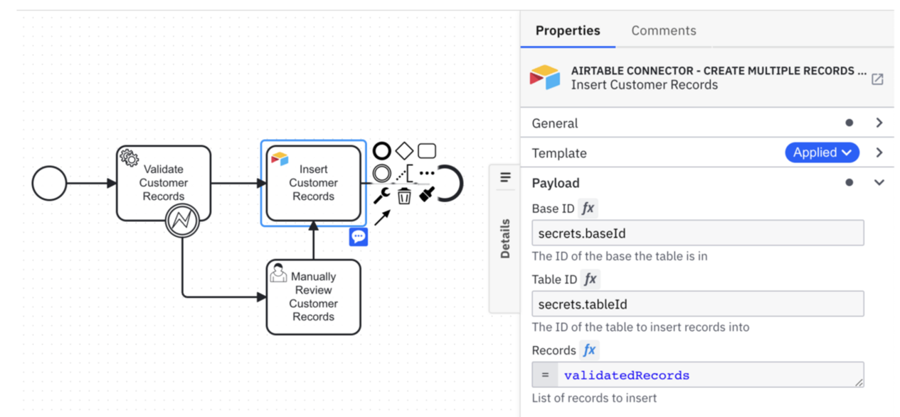

# Workshop: Camunda Connectors unleashed - Crafting future-proof low-code solutions

> This workshop has been created for CamundaCon New York 2024 but can also be completed asynchronously.

## Abstract
Join us for practical insight into the world of Camunda connectors, and learn how to best use them cleanly and efficiently
in low-code environments. We’ll look at the common challenges of using connectors and explain how to develop your own that
are sustainable and suited to specific needs of our business. We will also dive into development to understand the Camunda
connector ecosystem holistically, and put all the pieces of the puzzle together to design a holistic clean process architecture
that can be operated sustainably and is future-proofed with Camunda connectors.

## Introduction
### Why bother with Connectors? 
Want to democratize software development? Camunda Connectors are the key.
Camunda Connectors allow users to create reusable pieces of code. These pieces can be used in various processes.

This means business users can create and automate processes without needing technical skills.
Here are the key benefits:
- **Reusable Code**: Save time and effort by using the same code in different processes.
- **Democratize Development**: Make process automation accessible to everyone in your organization.
- **Overcoming Developer Shortage**: The limited resources are always the developers. Low-code and connectors enable organisation to overcome this shortage
- **Better Communication**: Model-based development makes it possible to have an abstraction to the code and thus ensures a common language that both business and IT can understand. 

Though, crafting these reusable connectors in a sustainable fashion can be a challenge. 

### What is a Camunda Connector? 
A Connector is a reusable, environment agnostic piece of code. It can either be inbound or outbound. 
- **Inbound Connector**: Enable workflows to receive data or messages from external systems or services. 
- **Outbound Connector**: Enables workflows to trigger the external systems or services.

Camunda offers out-of-the-box connectors, though you can also implement your own. You can find an illustration of an exemplary connector below.

### Why implementing Connectors in a sustainable fashion? 
Building sustainable connectors for better automation.
Creating sustainable connectors is a game-changer in our automation journey. Why is this so crucial? It allows us to decouple our external systems from our process (BPMN), ensuring our business processes stay stable and unbiased.

When we rely on out-of-the-box connectors, we can encounter tight coupling issues. For instance, a Stripe connector would embed Stripe-specific details, which we should avoid to keep our processes clean and resilient.

Here’s how we can achieve sustainable connectors:
- Domain Activities: Prioritize domain activities over technical ones. This approach keeps our BPMN clean, stable, and focused on core business functions.
- Avoid Dependencies: Reduce dependencies on external systems. By doing so, we lower risks and enhance our system's flexibility.
- Stable Processes: Ensure that our business processes remain stable even when external systems undergo changes. This is key to maintaining a robust automation framework.

Fast-forward to implementing these strategies, we create a robust and adaptable automation system. This approach allows us to face fewer disruptions and maintain a seamless workflow.

## Workshop 
### Setting
For this workshop we are going to take a peak on Camunbankia. A fictional bank which is being operated by Camunda. 
They have this  typical KYC Process and want to use Connectors to improve the process. 

The process starts when an application is being received. Afterwards, we want to use a [low-code connector](#building-a-sustainable-connector-using-low-code-) to integrate into our external credit score system. 
Once achieved we will verify all the other information and then take a decision on how to proceed with the application. If the credit score returned no risk, we can onboard the new customer. Though if there is a 
medium risk, we need to manually check and review the application. Once done it can be either rejected or accepted. If there is a high risk, we are going to immediately notify the applicant about the rejection. 

The rejection is being handled in an integrative process. That basically means that we exclude all the technical details in our parent process and focus on the actual domain logic. 
In the integrative process we showcase, how a [pro-code connector](#building-a-sustainable-connector-using-pro-code) can be used.

You can see the process model for this workshop below: 

### Building a sustainable Connector using Low-Code 
In this section we will use a connector template, also known as element template, to create a domain specific connector on top of an out-of-the-box REST connector. 

Therefore, we need to write the template first of all. 
Secondly, the template needs to be attached to the process. 

Information on the specification can be found here: https://docs.camunda.io/docs/components/connectors/custom-built-connectors/connector-templates/

Need a hint? The solution can be found here: [solution](kyc-process-app/src/main/resources/.camunda/element-templates/Credit%20Score%20Template.json)

### Building a sustainable Connector using Pro-Code
Let's take a closer look onto the integrative process for notifying a customer about a rejection.
In there we want to notify the customer based on the preferences which are being specified in their profile. Once retrieved we are going to send out a notification. 
If it fails to be delivered we ideally want to throw a BPMN Error boundary event to propagate a task for our clerk. 

Find the process below: 

To implement an outbound connector we can use a template by Camunda. That would be a good starting point for you to create a pro-code connector: https://github.com/camunda/connector-template-outbound

To build a sustainable connector we are going to use a hexagonal architecture. This allows us to keep the domain specific data transformations separate from the API requirements of the third party application. 
In belows graphic you can find a hexagonal architecture: 

